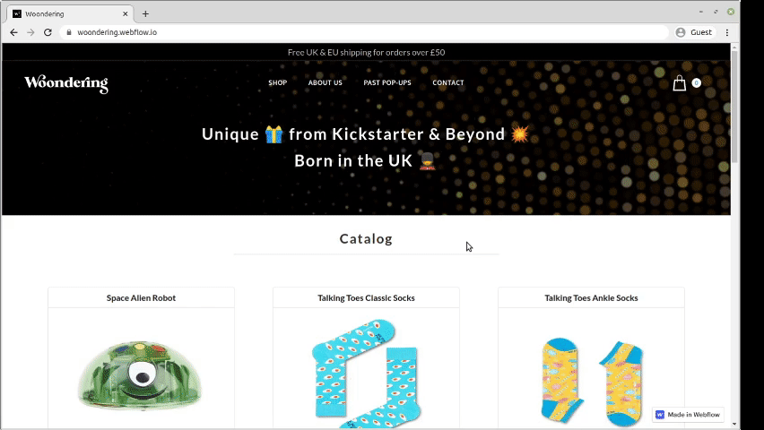
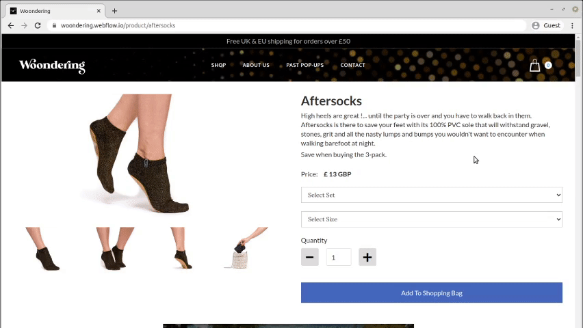
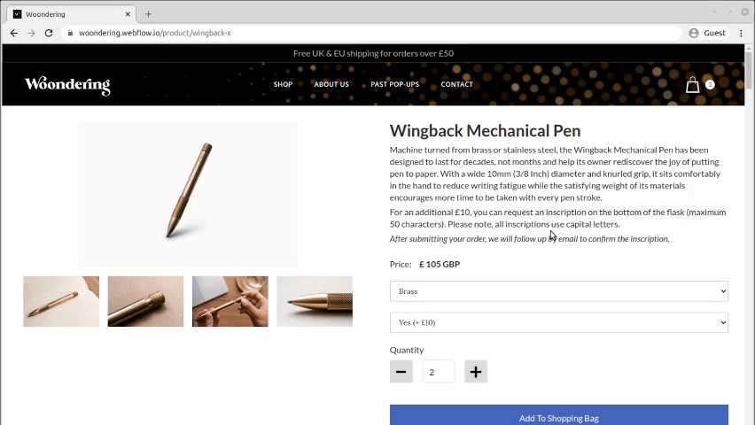
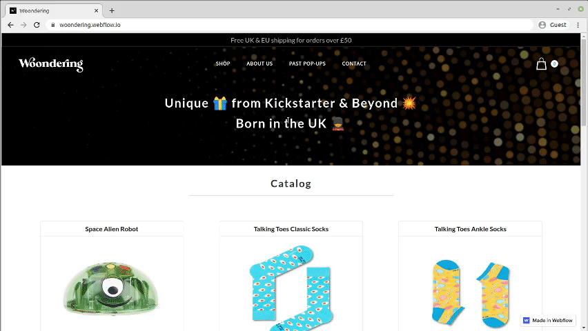
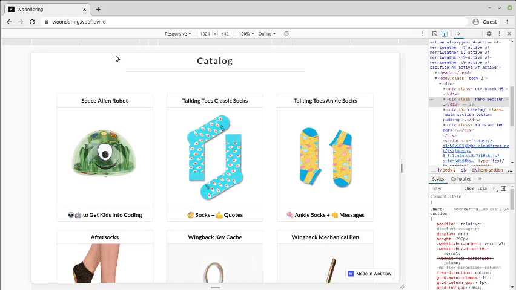

# Webflow ecommerce site

Fully-fledged ecommerce site built with [Webflow's standard ecommerce plan](https://webflow.com/pricing#site). [Link](https://woondering.webflow.io/) to live site.

**Note:** This repo only contains a description of the project. [Click here](https://preview.webflow.com/preview/woondering?utm_medium=preview_link&utm_source=designer&utm_content=woondering&preview=e6f28b3dc9e04825bca0c648c36755b3&mode=preview
) if you'd like to copy the project in Webflow.

# How it works

When you enter the site, you'll be shown all of the products on the page.

Clicking on a product will redirect you to the product's page, where you can find a detailed description.

When shopping, you have 2 product option modifiers and a quantity modifier at your disposal. Once you've made your choices for a given product, you can add to the `shopping bag` which will render a pop-up modal. 

The modal displays some key information about the items in your basket. You can modify the quantity, remove items, resume shopping or continue to checkout. The website will obviously remember the items in your basket when you go to another page. **Note:** you can't access the checkout page unless you're subscribed to one of Webflow's ecommerce plans.

There's an `About` page which renders some static content with a fading-in effect...

...and a `Past Pop-Ups` page displaying content rendered from Webflow's CMS...

...and a `Contact Us` page. 

**Note:** you can't submit the form as I've deactivated my Webflow subscription.

Final point - the website looks great across all devices:

